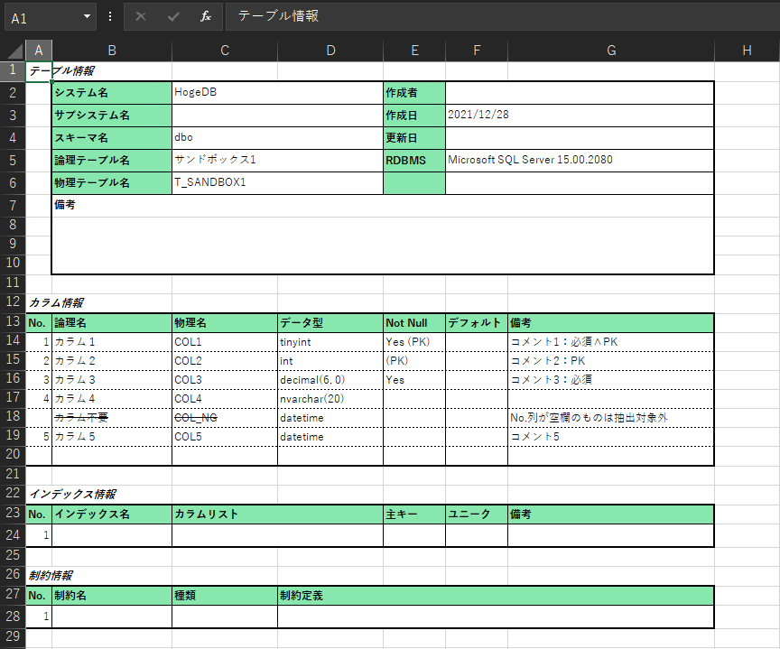
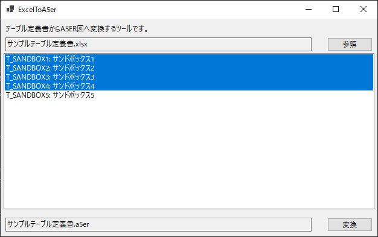
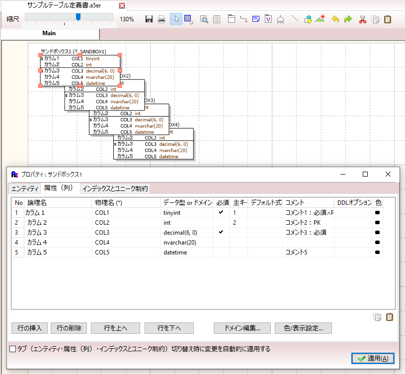

# ExcelToA5er
`A5:SQL Mk-2` で出力されたテーブル定義書 (`.xlsx`) から ER 図ファイルのスケルトン (`.a5er`) へ変換するツールです。

本ツールは以下サンプルを C# へ移植したものになります。
* [よくあるテーブル定義書からER図のスケルトンを生成する](https://a5m2.mmatsubara.com/tips/er_skeleton/)

## 対象バージョン

* A5:SQL Mk-2 Version 2.16+

## 注意事項

本ツールで生成される ER 図ファイルは最低限のものです。
スケルトン生成後に `A5:SQL Mk-2` 上で編集してください。

* 各エンティティの位置は単純に重ねて表示

## テーブル定義書 (`.xlsx`)

テーブル定義書 (`.xlsx`) から抽出する情報は以下の通りです。

| セル         | 内容                   | 設定 | 備考                                                       |
| ------------ | ---------------------- | ---- | ---------------------------------------------------------- |
| 'A1'         | セル値が右記備考欄の値 | 任意 | "テーブル情報" または "エンティティ情報"                   |
| 'C5'         | 論理テーブル名         | 任意 |                                                            |
| 'C6'         | 物理テーブル名         | 必須 |                                                            |
| カラム情報行 | カラム情報の開始位置   | 任意 | "カラム情報"キーワードを含む行を自動検索（最初の50行以内） |
| 'A列'～      | No.列                  | 任意 | No.列が空欄のものは抽出対象外                              |
| 'B列'～      | 論理カラム名           | 任意 |                                                            |
| 'C列'～      | 物理カラム名           | 必須 | 物理カラム名が空欄になるまで行方向を走査                   |
| 'D列'～      | SQL データ型           | 必須 |                                                            |
| 'E列'～      | NotNullかどうか        | 必須 | "Yes"が含まれる：NOT NULL列／"PK"が含まれる：PK列          |
| 'G列'～      | コメント               | 任意 |                                                            |

## 操作方法

1. テーブル定義書の準備

    

2. 本ツールの実行

    

3. `A5:SQL Mk-2` で ER 図の編集

    

4. `A5:SQL Mk-2` で DDL によるスクリプト生成

    
